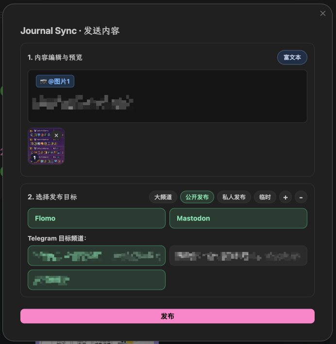
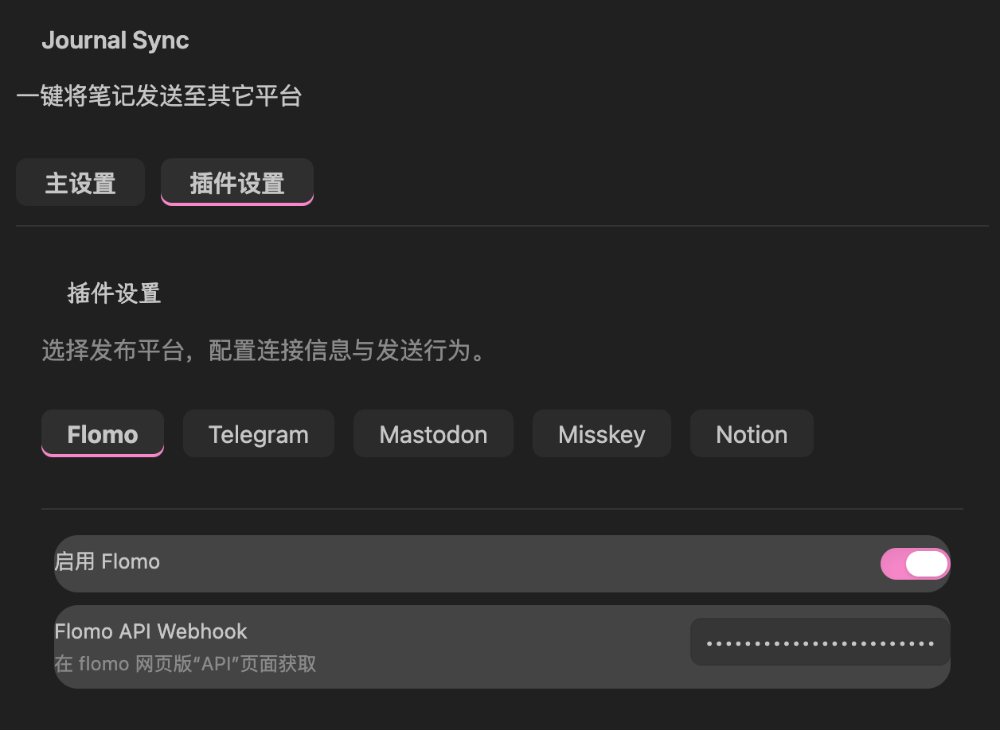

# Journal Sync

[English](README.md) · [安装](#安装) · [首次配置](#首次配置) · [开发说明](docs/development.md)

**写在 Obsidian，发布到你常用的平台。**

Journal Sync 可以把 Obsidian 中选中的文字、当前标题片段或整篇笔记发送到 **flomo、Telegram、Mastodon、Misskey、Bluesky 和 Notion**。插件完全运行在 Obsidian 内，无需安装 Node.js、Python，也不需要单独部署后端服务。



## 从记录到发布

1. 执行 **JournalSync-New**，打开今天的日记并插入一个时间标题。
2. 像平常一样记录，也可以直接引用 Vault 中的图片。
3. 选中想发布的文字，或把光标放在对应标题片段中，然后执行 **JournalSync-Send**。
4. 在发送面板中确认内容、选择一个或多个目标，点击发布或按 <kbd>Ctrl/Cmd+Enter</kbd> 快捷发送。

命令都通过命令面板运行：按 <kbd>Ctrl/Cmd+P</kbd>，输入部分名称（比如 `send`）回车即可找到 **JournalSync-Send**。最近使用过的命令会自动排在前面，日常发布就是三步：打开面板、执行 Send、点击发布。

发送面板会记住不同场景的目标预设，支持同时选择多个 Telegram 频道；发布提交后在后台继续，不会挡住当前的记录工作。

## 主要功能

- **快速开始今天的记录**：自动创建或打开今日日记，并定位到新的时间标题下。
- **准确选择发送范围**：发送选中文字、指定级别的当前标题片段，或整篇笔记。
- **一次选择多个目标**：在同一个面板中勾选多个平台和 Telegram 频道。
- **识别 Vault 本地图片**：支持 Markdown 图片和 Wiki 链接，不依赖操作系统绝对路径。
- **发送前可编辑预览**：发布前调整文字、图片取舍和图片顺序。
- **配置保存在本地**：账号信息由 Obsidian 保存，Journal Sync 不经过自建中转服务器。

## 安装

1. 打开[最新 GitHub Release](https://github.com/LinYunerr/Journal-Sync/releases/latest)。
2. 下载 `main.js`、`manifest.json` 和 `styles.css`。
3. 将这三个文件放入：

   ```text
   <你的 Vault>/.obsidian/plugins/journal-sync-bridge/
   ```

4. 打开 Obsidian 的 **设置 → 第三方插件**，刷新插件列表并启用 **Journal Sync**。

安装只需要上述三个文件。不要复制 `data.json`，其中保存着你的本地账号配置。

## 首次配置

启用插件后，打开 **设置 → Journal Sync**。



1. 在 **主设置** 中选择日记目录、文件名规则、时间标题格式、默认发送范围和本地图片行为。
2. 在 **插件设置** 中启用需要的平台，并填写对应的连接信息。
3. 使用 Telegram 时，填写 Bot Token，获取频道列表，再选择默认频道。

## 使用 Journal Sync

两个命令都可以在命令面板（<kbd>Ctrl/Cmd+P</kbd>）中运行，也可以在 **设置 → 快捷键** 中绑定快捷键。

| 命令 | 作用 |
| --- | --- |
| `JournalSync-New` | 创建或打开今日日记，追加时间标题，并把光标放到标题下。也可以点击左侧 Ribbon 的铅笔图标。 |
| `JournalSync-Send` | 根据选中文字或光标位置打开发送面板。 |

如果已经选中文字，插件始终优先发送选中内容。没有选中文字时，则按照设置中的发送范围，发送光标上方最近的 `#` 到 `######` 标题片段或整篇笔记。标题片段指该标题行到下一个同级或更高级标题之间的内容，标题行本身不会包含在发送的正文中；发送到 Notion 时，这个标题的文字会用作页面标题。如果光标不在所选级别的标题之下，或该片段为空，插件会给出提示而不发送。发送范围默认为 `##`，与默认的时间标题级别一致。

### 发送面板中的图片

本地图片会在正文中显示为 `@图片1` 这样的 token，并在编辑区下方显示缩略图。Telegram 富文本发送会按照 token 的位置排列图片；移动 token 可以调整顺序，删除 token 则不会发送对应图片。

## 支持的平台

| 平台 | 文字 | Vault 图片 | 说明 |
| --- | :---: | :---: | --- |
| flomo | ✓ | — | 通过 flomo API Webhook 发布。 |
| Telegram | ✓ | ✓ | 支持多个频道、普通发送，以及保留图片位置和受支持 Markdown 的富文本发送。 |
| Mastodon | ✓ | — | 可配置实例地址和可见性。 |
| Misskey | ✓ | — | 可配置实例地址和可见性。 |
| Bluesky | ✓ | ✓ | 使用 App Password 登录（在 Bluesky 设置 → Privacy & security → App passwords 生成）。单帖上限 300 个可见字符且不超过 3,000 个 UTF-8 字节，最多 4 张图片（JPEG/PNG/WebP/GIF，每张 2 MB）。 |
| Notion | ✓ | ✓ | 可以创建页面或数据库记录，并上传正文引用的本地图片。 |

各平台自身的限制仍然适用。较长的 Telegram 消息会自动分段，媒体数量和 caption 长度遵循 Telegram Bot API 的限制。

## 隐私与账号信息

Journal Sync 从 Obsidian 直接请求各目标平台。Token、Webhook、频道 ID 和其他设置保存在：

```text
<你的 Vault>/.obsidian/plugins/journal-sync-bridge/data.json
```

`data.json` 不会进入本仓库或 GitHub Release。不要把它上传到 Issue 或提交到 Git；如果凭据曾经公开，请立即到对应平台撤销并重新生成。

## 兼容性

- Obsidian `1.5.0` 或更高版本
- Windows、macOS、Linux
- 插件未限制为仅桌面端；移动端请按实际使用的平台进行验证

## 开发说明

架构、构建、发布流程和新增平台方式统一维护在 [docs/development.md](docs/development.md) 中。

Journal Sync 基于 [MIT License](LICENSE) 开源。
